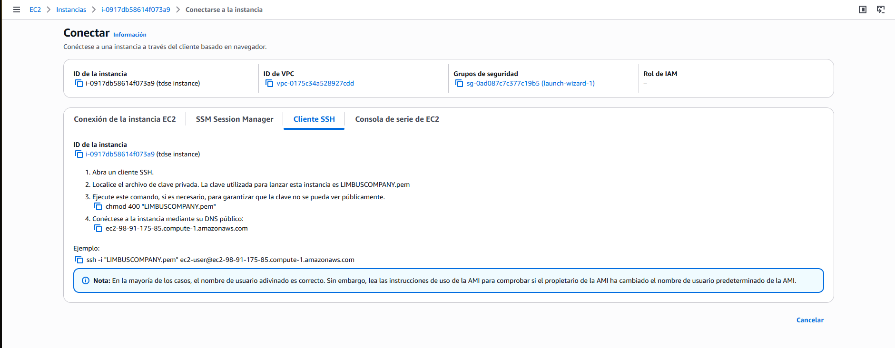
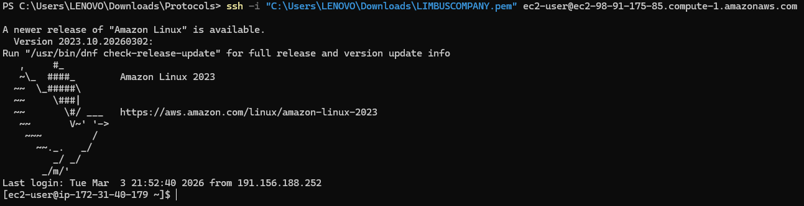
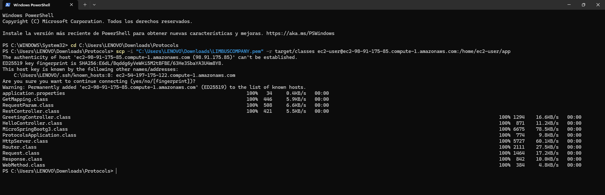
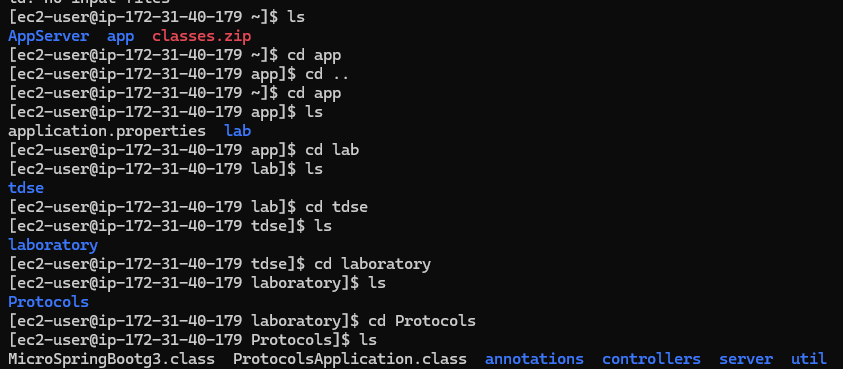
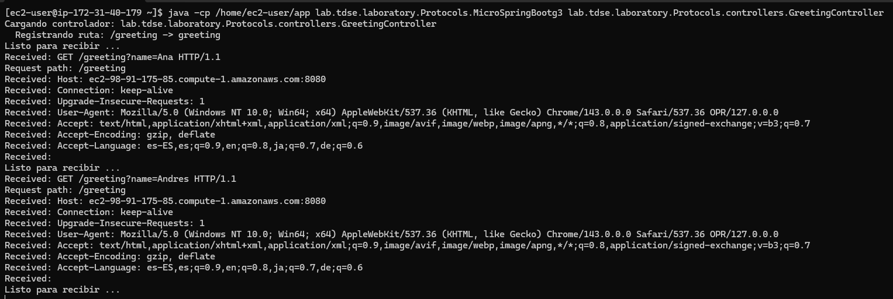
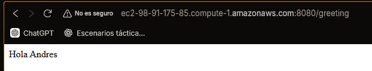
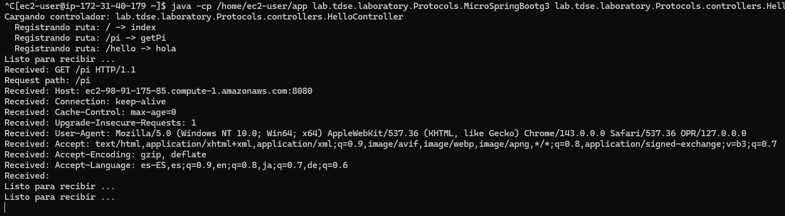
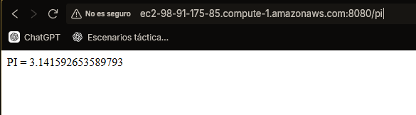

# Taller-de-Arquitecturas-de-Servidores-de-Aplicaciones

## Mini HTTP Framework — Java with Annotation-Based Controllers

A lightweight HTTP server framework built from scratch in Java, inspired by microframeworks like Spring Boot and Spark. It allows developers to define REST endpoints using **annotations** (`@RestController`, `@GetMapping`, `@RequestParam`) and serves static files with minimal configuration. Includes an **auto-scan mechanism** that discovers and registers controllers at startup via reflection.

---

## Features

- Define REST routes using `@GetMapping` annotations on controller methods
- Inject query parameters into method arguments via `@RequestParam`
- Auto-scan the classpath for `@RestController` classes at startup
- Manual controller loading by passing a class name as a CLI argument
- Serve static files (HTML, CSS, JS, images) from a configurable folder via `Router.staticfiles()`
- Automatic content-type detection for common file types
- Persistent server loop — handles multiple requests sequentially

---

## Project Architecture

```
src/
└── main/
    └── java/
        └── lab/tdse/laboratory/Protocols/
            ├── annotations/
            │   ├── GetMapping.java         # Maps a method to a GET route
            │   ├── RequestParam.java       # Binds a query param to a method argument
            │   └── RestController.java     # Marks a class as a REST controller
            ├── controllers/
            │   ├── GreetingController.java # Example: /greeting?name=X
            │   └── HelloController.java    # Example: /, /pi, /hello
            ├── server/
            │   ├── HttpServer.java         # TCP server, HTTP parser, dispatcher
            │   └── Router.java             # Route registry and static file config
            ├── util/
            │   ├── Request.java            # Wraps path, method, and query params
            │   ├── Response.java           # Holds status code and content-type
            │   └── WebMethod.java          # Functional interface for route handlers
            └── MicroSpringBootg3.java      # Entry point: scan + register + launch
```

---

## Component Responsibilities

| Component | Responsibility |
|---|---|
| `HttpServer` | Accepts TCP connections, parses HTTP request lines, dispatches to `Router` or serves static files |
| `Router` | Stores registered routes and static folder config; resolves incoming paths |
| `MicroSpringBootg3` | Entry point: scans classpath for `@RestController`, registers routes via reflection, launches `HttpServer` |
| `@RestController` | Marks a class for auto-discovery during classpath scan |
| `@GetMapping` | Annotates a method with a URL path to register as a GET route |
| `@RequestParam` | Binds a query string parameter to a method parameter, with optional default value |
| `Request` | Wraps parsed path, method, and query parameters |
| `Response` | Holds status code and content-type for the response |
| `WebMethod` | `@FunctionalInterface` — enables lambda-based route handlers in `Router` |

---

## Request Flow

```
Browser Request
      │
      ▼
 HttpServer (parses HTTP request line)
      │
      ├── Route registered? ──YES──► Router.handle() ──► WebMethod lambda ──► HTML response
      │
      └── NO ──► serveStaticFile() ──► reads file from target/classes/<staticFilesFolder>/
```

---

## How to Run

### Prerequisites
- Java 17+
- Maven 3.x

### 1. Clone the repository

```bash
git clone <repository-url>
cd <project-folder>
```

### 2. Build the project

```bash
mvn compile
```

This compiles all source files and copies resources to `target/classes/`.

### 3. Start the server

**Option A — Auto-scan (discovers all `@RestController` classes automatically):**

```bash
java -cp target/classes lab.tdse.laboratory.Protocols.MicroSpringBootg3
```

**Option B — Load a specific controller by class name:**

```bash
java -cp target/classes lab.tdse.laboratory.Protocols.MicroSpringBootg3 lab.tdse.laboratory.Protocols.controllers.GreetingController
```

The server will start on port **8080**.

---

## Usage Examples

### Registered REST Routes

| URL | Response |
|---|---|
| `http://localhost:8080/` | `Greetings from Spring Boot!` |
| `http://localhost:8080/pi` | `PI = 3.141592653589793` |
| `http://localhost:8080/hello` | `LIMBUS COMPANYYYYYYYYYYYY` |
| `http://localhost:8080/greeting?name=Ana` | `Hola Ana` |
| `http://localhost:8080/greeting` | `Hola World` (default value) |

---

## Proof:
















